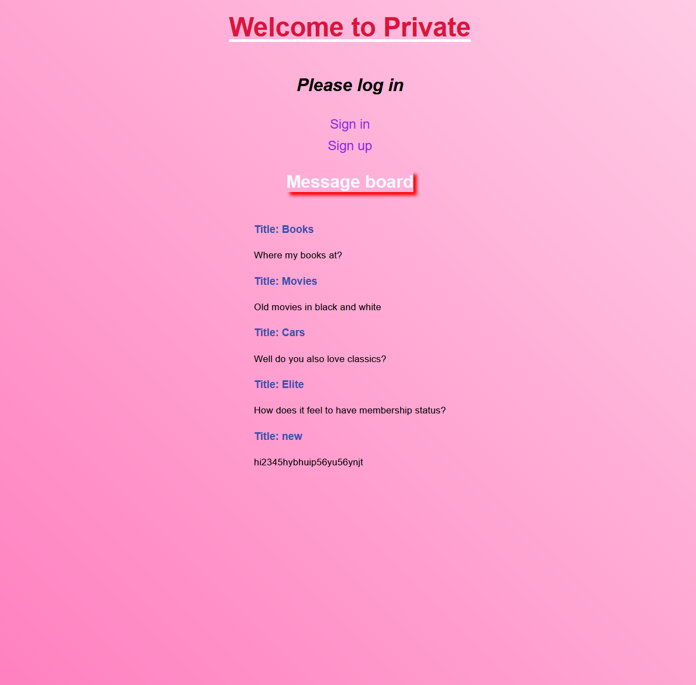

# Message board

This project uses EJS as a templating language for the frontend and Express, NodeJS and MongoDB for the backend. Project is using Passport.js with a local strategy to authenticate users.

## The Odin Project: Lesson Members Only

This project is build according to the specification of the [Members Only lesson](https://www.theodinproject.com/lessons/nodejs-members-only)

## Preview

